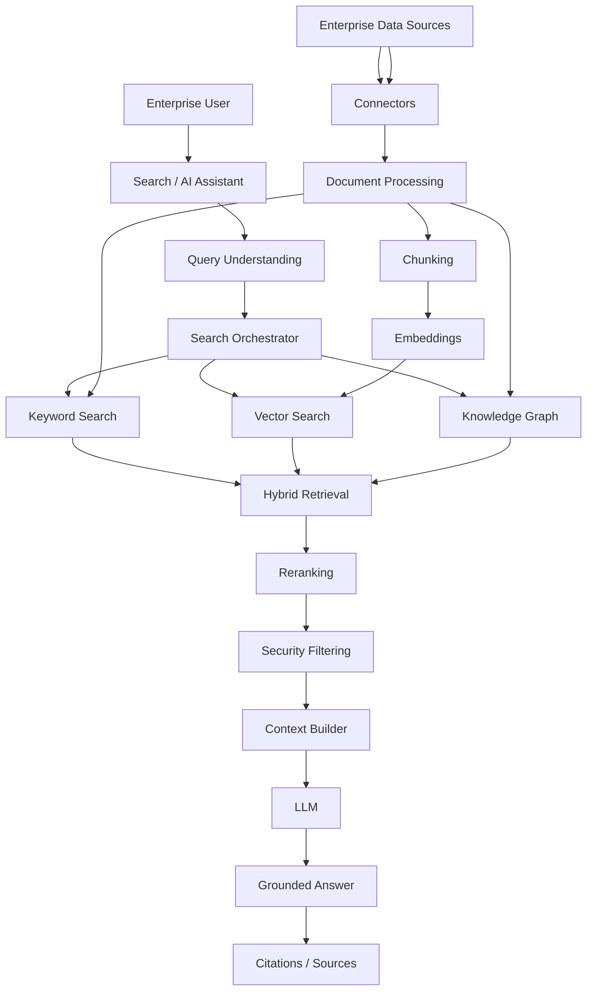
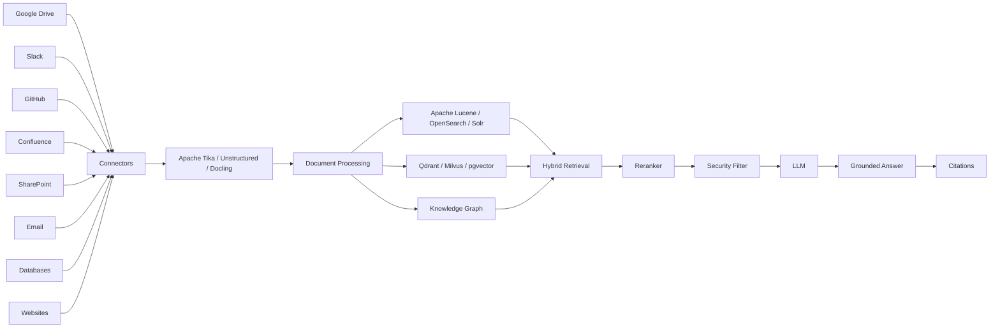
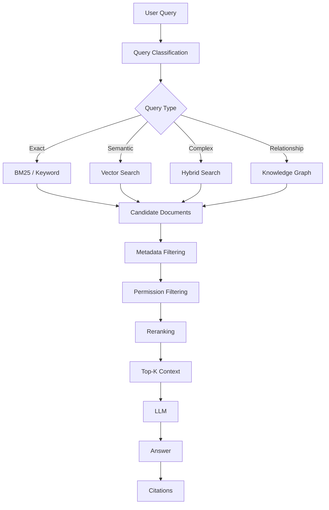
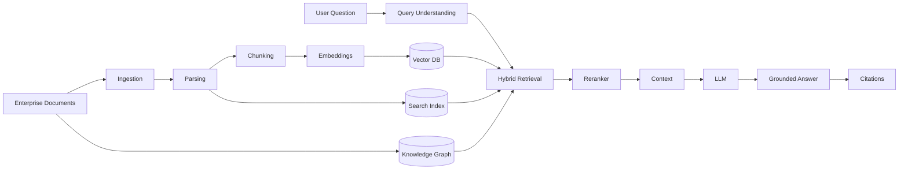
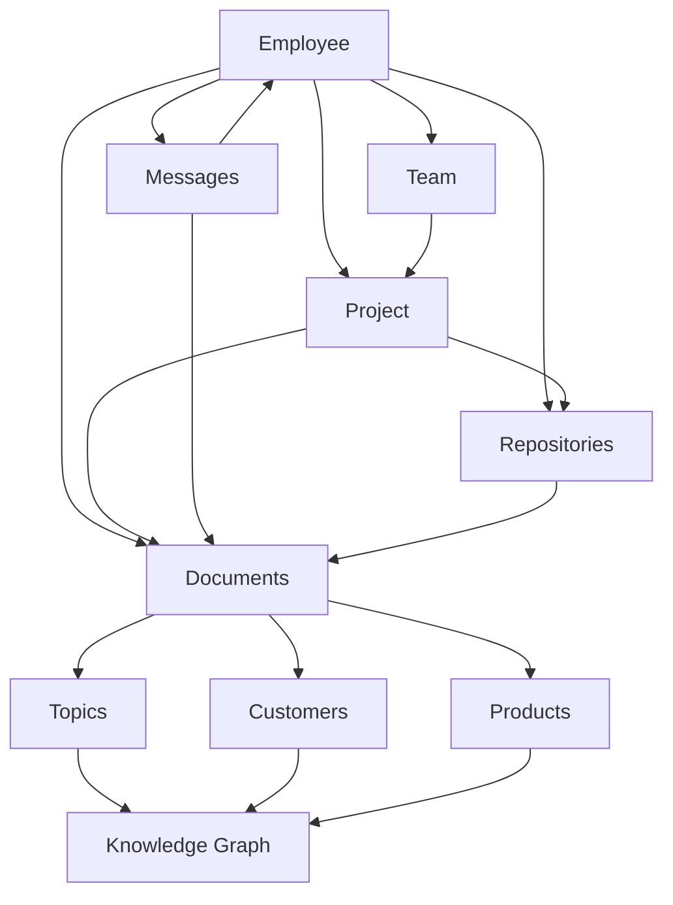
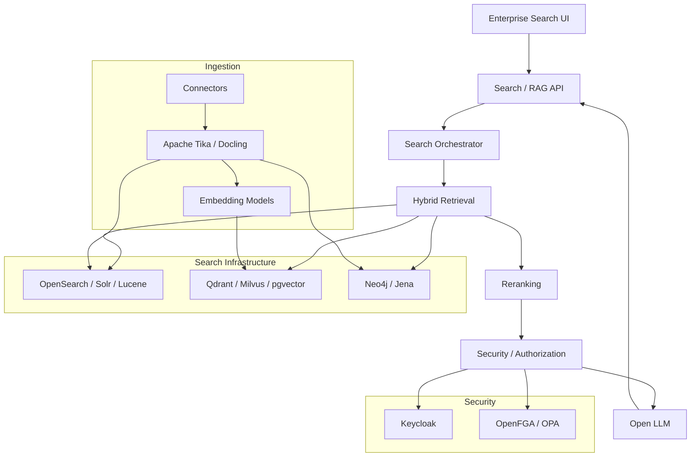
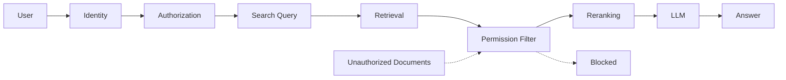

<p align="center">
  
</p>

# 🔎 Awesome Enterprise AI Search

<p align="center">
  <a href="https://github.com/ishandutta2007/Awesome-Awesome-Awesome"></a>
  <a href="https://discord.gg/jc4xtF58Ve"></a>
  <a href="https://github.com/ishandutta2007/Awesome-Enterprise-AI-Search/stargazers"></a>
  <a href="https://github.com/ishandutta2007/Awesome-Enterprise-AI-Search/network/members"></a>
  <a href="https://github.com/ishandutta2007/Awesome-Enterprise-AI-Search/issues"></a>
  <a href="https://github.com/ishandutta2007/Awesome-Enterprise-AI-Search/blob/main/LICENSE"></a>
  <a href="https://makeapullrequest.com"></a>
  <a href="https://github.com/ishandutta2007"></a>
</p>


> A curated list of **Enterprise AI Search** platforms and open-source alternatives for intelligent workplace search, semantic search, vector search, hybrid retrieval, RAG, knowledge discovery, and AI-powered enterprise knowledge access.


Enterprise AI Search platforms go beyond traditional keyword search by combining **full-text search, semantic/vector retrieval, natural-language understanding, machine learning, knowledge graphs, personalization, connectors, access-control enforcement, and generative AI**.

This repository focuses primarily on **open-source alternatives** that can be used to build self-hosted equivalents of commercial Enterprise AI Search platforms.

### 🏷️ SEO & Industry Topics
`enterprise-search` • `ai-search` • `semantic-search` • `vector-database` • `hybrid-retrieval` • `rag` • `retrieval-augmented-generation` • `knowledge-graphs` • `neural-search` • `workplace-search` • `glean-alternative` • `coveo-alternative` • `elastic-search` • `opensearch` • `document-processing`

---

## 🎯 Key Highlights & Architecture Themes

* 🔍 **Hybrid Retrieval**: Combining BM25 keyword precision with dense embedding semantic search and cross-encoder rerankers.
* 🔐 **Enterprise Security Trimming**: Document-level and field-level Access Control Lists (ACLs) using ReBAC/RBAC engines (OpenFGA, OPA, Keycloak).
* 🕸️ **Knowledge Graphs & Entity Resolution**: Connecting people, documents, tickets, and corporate entities for deep contextual reasoning.
* ⚡ **Open-Source Freedom**: Fully self-hostable, air-gapped, privacy-first architectures replacing expensive SaaS platforms.

---


## 📑 Table of Contents


* [☁️ SaaS/Hosted Platforms](#️-saashosted-platforms)

* [🌍 Open-Source](#-open-source)

* [🔎 Open-Source Enterprise Search Platforms](#-open-source-enterprise-search-platforms)

* [🧠 Open-Source Neural & Semantic Search](#-open-source-neural--semantic-search)

* [📚 Open-Source RAG & Knowledge Platforms](#-open-source-rag--knowledge-platforms)

* [🗂️ Open-Source Search Engines & Indexing](#️-open-source-search-engines--indexing)

* [📄 Open-Source Document Processing & Ingestion](#-open-source-document-processing--ingestion)

* [🧮 Open-Source Vector Databases](#-open-source-vector-databases)

* [🕸️ Open-Source Knowledge Graphs](#️-open-source-knowledge-graphs)

* [🔐 Open-Source Search Security & Access Control](#-open-source-search-security--access-control)

* [📊 Open-Source Search Analytics & Observability](#-open-source-search-analytics--observability)

* [🏗️ Enterprise AI Search Architecture](#️-enterprise-ai-search-architecture)

* [🔄 Open-Source Enterprise AI Search Architecture](#-open-source-enterprise-ai-search-architecture)

* [🧩 Commercial Platform → Open-Source Equivalent](#-commercial-platform--open-source-equivalent)

* [⚖️ Commercial vs Open-Source](#️-commercial-vs-open-source)

* [🚀 Recommended Open-Source Stacks](#-recommended-open-source-stacks)

* [🧱 Enterprise AI Search Layers](#-enterprise-ai-search-layers)

* [🗺️ Enterprise AI Search Landscape](#️-enterprise-ai-search-landscape)

* [❓ Frequently Asked Questions (FAQ)](#-frequently-asked-questions-faq)

* [🤝 Contributing](#-contributing)

* [⭐ Star History](#-star-history)

* [⚠️ Disclaimer](#️-disclaimer)


---


# ☁️ SaaS/Hosted Platforms


Commercial Enterprise AI Search platforms provide managed indexing, enterprise connectors, relevance tuning, semantic/vector search, personalization, security trimming, analytics, and increasingly RAG and agentic search.

> 📊 **Market Overview:** The global Enterprise AI Search market is estimated at **$5.5B–$6.0B** and projected to reach **$14B–$15B+ by 2030 (CAGR ~14.2%)**. The sector is **moderately to highly fragmented** rather than a winner-take-all market, featuring coexistence between cloud hyperscalers (infrastructure & raw retrieval), specialized enterprise knowledge-graph search engines, and major workplace SaaS incumbents embedding native AI search.

| Platform | Company | Company Size (Valuation / Revenue) | Primary Focus | Key Capabilities | Pricing | Free Tier / Trial Limits |
| ------------------------------------------------------------------------------------------- | ------------ | ---------------------------------- | ------------------------------ | ------------------------------------------------------------------------------------------------------ | ---------------------------------------------------------------------------------------------------------------------------------------------------------- | -------------------------------------------------------------------------------------------------------------------------------------------------------------------------------------- |
| [Azure AI Search](https://azure.microsoft.com/products/ai-services/ai-search) | Microsoft | ~$3.1T Market Cap ($245B+ Rev) | Enterprise Retrieval | Full-text, vector, hybrid, multimodal, agentic retrieval, RAG | Basic tier starts at ~$73.73/month ($0.101/hour for 1 Search Unit with 15 GB storage & 15 indexes) | Free (F0) tier forever: 50 MB storage, 3 indexes, 3 indexers, 3 data sources, and up to 10,000 documents per index |
| [Azure AI Foundry / Foundry IQ](https://azure.microsoft.com/products/ai-services/ai-search) | Microsoft | ~$3.1T Market Cap ($245B+ Rev) | Agentic Enterprise Knowledge | Knowledge bases, agentic retrieval, grounding, enterprise data | $0 base platform fee; pay-as-you-go for underlying Azure AI Search (from ~$73.73/month) and LLM tokens (from $0.15/1M tokens) | Azure AI Search Free (F0) tier (50 MB storage, 3 indexes, 10,000 docs) + $200 Azure cloud credits for first 30 days |
| [Google Vertex AI Search](https://cloud.google.com/enterprise-search) | Google Cloud | ~$2.1T Market Cap ($350B+ Rev) | Enterprise / Generative Search | Semantic search, RAG, grounding, connectors, generative answers | Standard Edition starts at $1.50 per 1,000 queries (Enterprise Edition starts at $4.00 per 1,000 queries) | Free forever tier of 10,000 queries/month per account; new GCP accounts also get $300 in free credits for 90 days |
| [Amazon Kendra](https://aws.amazon.com/kendra/) | AWS | ~$1.9T Market Cap ($620B+ Rev) | Enterprise Search | Connectors, semantic search, natural-language queries, enterprise content | GenAI Enterprise base starts at $0.32/hour (~$230/month); Developer Edition starts at $1.11/hour (~$810/month) | 750 hours free for the first 30 days on Developer or GenAI Enterprise Edition (up to 10,000 documents; connector run time excluded) |
| [Amazon OpenSearch Service](https://aws.amazon.com/opensearch-service/) | AWS | ~$1.9T Market Cap ($620B+ Rev) | Managed Search | Full-text, vector, hybrid search, neural search, RAG | Single-AZ `t3.small.search` starts at ~$0.036/hour (~$26.28/month on-demand); Serverless starts at $0.24/OCU-hour | 750 hours/month of single-AZ `t2.small.search` or `t3.small.search` + 10 GB EBS storage free for 12 months under AWS Free Tier |
| [Salesforce Agentforce Search](https://www.salesforce.com/agentforce/) | Salesforce | ~$280B Market Cap ($38B+ Rev) | CRM / Enterprise Knowledge | Enterprise data retrieval, grounding, AI agents | Starts at $2 per conversation, $125/user/month (standard seat licensing), or $500 per 100,000 Flex Credits | 30-day free trial of Salesforce Enterprise/Foundations (includes 100,000 Flex Credits for Agentforce & Prompt Builder) |
| [IBM watsonx Discovery](https://www.ibm.com/products/watson-discovery) | IBM | ~$200B Market Cap ($63B+ Rev) | Enterprise Knowledge Discovery | NLP, document understanding, search, discovery, AI-powered insights | Plus Plan starts at $500/month (includes 10,000 documents and 10,000 queries/month; Enterprise at $5,000/month) | 30-day free trial on the Plus Plan (includes up to 10,000 documents and 10,000 queries for 30 days) |
| [ServiceNow AI Search](https://www.servicenow.com/products/ai-search.html) | ServiceNow | ~$180B Market Cap ($11B+ Rev) | Enterprise / IT Search | Knowledge search, semantic understanding, contextual results | Bundled into ITSM/CSM Foundation tiers starting at ~$70–$100/user/month (annual contracts typically start at ~$10,000–$30,000/year) | No self-serve trial; enterprise Proof of Concept via sales; temporary lab instances provided in ServiceNow University training courses |
| [Atlassian Rovo](https://www.atlassian.com/software/rovo) | Atlassian | ~$45B Market Cap ($4.4B+ Rev) | Workplace Knowledge Search | Enterprise search, AI answers, knowledge discovery, agents | Included in Jira Cloud Standard ($8.15/user/month) & Confluence Standard ($6.05/user/month); Rovo Dev standalone is $20/user/month | 14-day free trial on Jira/Confluence Cloud Standard & Premium plans (or 30-day free trial for Rovo Dev) |
| [Notion Enterprise Search](https://www.notion.com/product/enterprise-search) | Notion | ~$10B Valuation ($100M+ ARR) | Workplace Search | Cross-app search, AI answers, workspace knowledge | Business plan starts at $20/user/month (billed annually; $24/user/month billed monthly) which includes full Notion AI & Enterprise Search | Free plan ($0 forever for up to 10 guests) includes 20 free Notion AI trial responses; plus 30-day free trial of Business Plan for teams |
| [Elastic AI Search](https://www.elastic.co/enterprise-search) | Elastic | ~$9.5B Market Cap ($1.3B+ Rev) | Enterprise Search & AI Search | Full-text, vector, hybrid search, RAG, relevance, observability | Standard tier starts at ~$95–$99/month (~$1.18/day; Platinum at ~$131/month, Enterprise at ~$184/month) | 14-day free trial (hosted cloud cluster with access across Search, Observability, and Security; no credit card required) |
| [Dropbox Dash](https://www.dropbox.com/dash) | Dropbox | ~$8.5B Market Cap ($2.5B+ Rev) | Workplace Search | Unified search, AI answers, connected knowledge | Dash for Teams starts at $15/user/month (billed annually; $35/user/month for larger enterprise plans) | 30-day free trial of Dash for Teams (unlimited unified search across connected apps, smart stacks; company directory excluded during trial) |
| [Glean](https://www.glean.com/) | Glean | ~$4.6B Valuation ($100M+ ARR) | Workplace / Enterprise Search | AI search, knowledge graph, 275+ connectors, semantic search, permissions, personalization, AI answers | Starts at ~$45–$75/user/month (min. 100 seats, ~$50,000–$60,000/year annual commitment) | No self-serve trial; sales-guided demo & proof of concept (custom sandbox with organizational connectors) |
| [Algolia NeuralSearch](https://www.algolia.com/products/features/neuralsearch) | Algolia | ~$2.25B Valuation ($100M+ ARR) | AI Application Search | Hybrid keyword + vector search, neural relevance, personalization, autocomplete | Grow pay-as-you-go starts at $0.50 per 1,000 requests; full NeuralSearch (Elevate tier) starts at ~$50,000/year | Free forever Build plan includes 10,000 search requests/month, 50,000 records, 5,000 recommendations, and 5,000 web crawl pages |
| [Coveo](https://www.coveo.com/) | Coveo | ~$750M Market Cap ($125M+ ARR) | Enterprise AI Search | AI relevance, semantic search, personalization, recommendations, RAG, commerce/workplace search | Starts at ~$990/month (Salesforce Pro+ package; core enterprise subscriptions start at ~$30,000/year) | 14-day free trial (no credit card required; includes 25+ connectors, 15+ ML models, sandbox prototyping) |
| [Coveo Relevance Cloud](https://www.coveo.com/en/products/relevance-cloud) | Coveo | ~$750M Market Cap ($125M+ ARR) | AI Relevance | Search, recommendations, personalization, generative answering | Starts at ~$990/month (integration packages; core enterprise cloud implementations start around ~$30,000/year) | 14-day free trial (no credit card required; includes 25+ connectors, 15+ ML models, prototype sandbox) |
| [Hebbia](https://www.hebbia.com/) | Hebbia | ~$700M Valuation (Private) | Enterprise Knowledge Work | AI search, document reasoning, knowledge retrieval | Lite seats start at ~$3,000–$3,500/user/year (~$250–$290/user/month; Pro seats ~$10,000/user/year; annual enterprise contracts) | No self-serve trial; evaluation through structured sales-guided demo and pilot program for enterprise teams |
| [Yext Search](https://www.yext.com/platform/search) | Yext | ~$700M Market Cap ($400M+ Rev) | Digital / Enterprise Search | AI search, knowledge graph, semantic search, structured content | Base packages start from ~$199/year per entity/location; enterprise search deployments typically start from ~$500/month | 90-day developer free trial via Yext Hitchhikers (up to 5,000 API requests/hour to test Knowledge Graph and Search) |
| [Lucidworks Fusion](https://lucidworks.com/platform/) | Lucidworks | ~$500M Valuation ($100M+ ARR) | Enterprise Search | Search applications, AI relevance, connectors, personalization, Solr-based architecture | Cloud deployments start at ~$3,000/month (annual contracts typically start at ~$28,000–$30,000/year) | 14-day sales-guided evaluation trial (provisioned sandbox environment with sample data and pipeline access) |
| [Guru](https://www.getguru.com/) | Guru | ~$300M Valuation ($25M+ ARR) | Enterprise Knowledge | Knowledge management, AI search, verification, contextual answers | Starts at $15/user/month (billed annually) or $25/user/month (billed monthly; 10-seat minimum / $250/month) | 30-day free trial (up to 2 workspaces, full access to AI search, browser extension, and knowledge verification) |
| [Sinequa](https://www.sinequa.com/) | Sinequa | ~$180M Valuation ($50M+ ARR) | Enterprise Knowledge Search | AI enterprise search, NLP, semantic search, knowledge discovery, RAG | Annual enterprise contracts typically start at ~$50,000–$100,000+/year based on indexed volume | No public self-service trial; formal sales-guided demo and multi-week enterprise proof-of-concept on customer data |
| [SearchUnify](https://www.searchunify.com/) | SearchUnify | ~$60M Scale (Grazitti Interactive) | Enterprise Search | AI search, semantic search, customer/employee knowledge | Pay-as-you-go starts at $0.025 per search request on AWS Marketplace; annual enterprise packages start around ~$50,000/year | 7-day free trial (allows connecting and indexing up to 2 enterprise content sources) |
| [Korra](https://www.korra.ai/) | Korra | ~$20M Valuation (Private) | Enterprise AI Search | Enterprise knowledge retrieval and AI answers | Entry plans start at ~$99–$199/month (or per user/month depending on plan tier) | 14-day free trial (access to AI search and knowledge ingestion sandbox) |


> **Note:** Commercial platforms differ substantially in connector ecosystems, security trimming, ranking models, analytics, personalization, and managed infrastructure. They are not all interchangeable.


---


# 🌍 Open-Source


Open-source Enterprise AI Search can be assembled from a combination of:


```text

Search Engine

      +

Semantic / Vector Search

      +

Document Processing

      +

Connectors / Crawlers

      +

RAG

      +

Knowledge Graph

      +

Access Control

      +

LLM / Embedding Models

      +

Observability

```


The strongest open-source approach is therefore usually **composable rather than a single product**.


---


# 🔎 Open-Source Enterprise Search Platforms


| Project | License | Description |
| --- | --- | --- |
| [Meilisearch](https://github.com/meilisearch/meilisearch) [](https://github.com/meilisearch/meilisearch/stargazers) | MIT | Fast open-source search engine optimized for developer-friendly instant search |
| [Onyx](https://github.com/onyx-dot-app/onyx) [](https://github.com/onyx-dot-app/onyx/stargazers) | MIT | Open-source enterprise AI search and workplace assistant with 40+ native connectors (formerly Danswer) |
| [Typesense](https://github.com/typesense/typesense) [](https://github.com/typesense/typesense/stargazers) | GPL-3.0 | Developer-friendly open-source search engine with typo tolerance, faceting, semantic/vector search and fast autocomplete |
| [Sonic](https://github.com/valeriansaliou/sonic) [](https://github.com/valeriansaliou/sonic/stargazers) | MPL-2.0 | Lightweight search backend for fast text indexing and querying |
| [ZincSearch](https://github.com/zincsearch/zincsearch) [](https://github.com/zincsearch/zincsearch/stargazers) | Apache-2.0 | Lightweight open-source search and analytics engine written in Go |
| [Tantivy](https://github.com/quickwit-oss/tantivy) [](https://github.com/quickwit-oss/tantivy/stargazers) | MIT | Rust search engine library inspired by Lucene with high indexing performance |
| [OpenSearch](https://github.com/opensearch-project/OpenSearch) [](https://github.com/opensearch-project/OpenSearch/stargazers) | Apache-2.0 | Open-source distributed search and analytics platform with full-text, vector, hybrid, neural search, RAG and enterprise security |
| [Manticore Search](https://github.com/manticoresoftware/manticoresearch) [](https://github.com/manticoresoftware/manticoresearch/stargazers) | GPL-2.0 | High-performance search engine and Elasticsearch alternative with fast columnar storage and vector search |
| [Quickwit](https://github.com/quickwit-oss/quickwit) [](https://github.com/quickwit-oss/quickwit/stargazers) | Apache-2.0 | Cloud-native distributed search engine optimized for object storage and petabyte-scale search |
| [Bleve](https://github.com/blevesearch/bleve) [](https://github.com/blevesearch/bleve/stargazers) | Apache-2.0 | Modern text indexing and search library for Go applications |
| [Vespa](https://github.com/vespa-engine/vespa) [](https://github.com/vespa-engine/vespa/stargazers) | Apache-2.0 | Open-source AI search platform combining text, vectors, tensors, structured data and machine-learned ranking |
| [Apache Lucene](https://github.com/apache/lucene) [](https://github.com/apache/lucene/stargazers) | Apache-2.0 | High-performance search library underlying many modern search engines including Solr and Elasticsearch |
| [Apache Solr](https://github.com/apache/solr) [](https://github.com/apache/solr/stargazers) | Apache-2.0 | Mature enterprise search platform built on Apache Lucene with full-text, vector, faceting and distributed search |

---


# 🧠 Open-Source Neural & Semantic Search


Modern Enterprise AI Search typically combines **BM25 / lexical retrieval + dense vector retrieval + reranking**.


| Project | License | Primary Capability |
| --- | --- | --- |
| [Milvus](https://github.com/milvus-io/milvus) [](https://github.com/milvus-io/milvus/stargazers) | Apache-2.0 | Distributed vector database for large-scale AI retrieval and similarity search |
| [Faiss](https://github.com/facebookresearch/faiss) [](https://github.com/facebookresearch/faiss/stargazers) | MIT | High-performance vector similarity search and clustering library by Meta |
| [ScaNN](https://github.com/google-research/google-research/tree/master/scann) [](https://github.com/google-research/google-research/stargazers) | Apache-2.0 | Efficient vector similarity search and maximum inner product search by Google Research |
| [Qdrant](https://github.com/qdrant/qdrant) [](https://github.com/qdrant/qdrant/stargazers) | Apache-2.0 | Vector database and semantic retrieval engine with payload filtering and hybrid search |
| [pgvector](https://github.com/pgvector/pgvector) [](https://github.com/pgvector/pgvector/stargazers) | PostgreSQL License | Vector similarity search directly inside PostgreSQL |
| [Annoy](https://github.com/spotify/annoy) [](https://github.com/spotify/annoy/stargazers) | Apache-2.0 | Approximate nearest-neighbor search library optimized for memory-mapped files by Spotify |
| [txtai](https://github.com/neuml/txtai) [](https://github.com/neuml/txtai/stargazers) | Apache-2.0 | All-in-one embeddings database for semantic search, LLM orchestration, and RAG pipelines |
| [Vespa](https://github.com/vespa-engine/vespa) [](https://github.com/vespa-engine/vespa/stargazers) | Apache-2.0 | Vector, tensor, text and structured retrieval with ML ranking |
| [HNSWlib](https://github.com/nmslib/hnswlib) [](https://github.com/nmslib/hnswlib/stargazers) | Apache-2.0 | Fast approximate nearest-neighbor search using Hierarchical Navigable Small World graphs |
| [Marqo](https://github.com/marqo-ai/marqo) [](https://github.com/marqo-ai/marqo/stargazers) | Apache-2.0 | End-to-end multimodal vector search and hybrid retrieval engine |
| [Infinity](https://github.com/infiniflow/infinity) [](https://github.com/infiniflow/infinity/stargazers) | Apache-2.0 | AI-native search engine supporting dense vectors, full-text, and sparse embeddings |
| [USearch](https://github.com/unum-cloud/usearch) [](https://github.com/unum-cloud/usearch/stargazers) | Apache-2.0 | Compact high-performance vector search library compatible with Faiss |
| [Apache Lucene](https://github.com/apache/lucene) [](https://github.com/apache/lucene/stargazers) | Apache-2.0 | Full-text and approximate nearest-neighbor HNSW vector search |
| [Apache Solr](https://github.com/apache/solr) [](https://github.com/apache/solr/stargazers) | Apache-2.0 | Full-text + vector search + dense vector hybrid retrieval |
| [OpenSearch Neural Search](https://github.com/opensearch-project/neural-search) [](https://github.com/opensearch-project/neural-search/stargazers) | Apache-2.0 | Neural retrieval, embeddings, semantic search and hybrid retrieval plugin for OpenSearch |

### Hybrid Search


```text

                  User Query

                      │

             ┌────────┴────────┐

             │                 │

       Keyword Search      Vector Search

          (BM25)          (Embeddings)

             │                 │

             └────────┬────────┘

                      │

                Result Fusion

                      │

                  Reranker

                      │

               Final Results

```


Hybrid retrieval is particularly important for Enterprise AI Search because exact identifiers, names, product codes and acronyms often require lexical search while natural-language questions benefit from semantic retrieval.


---


# 📚 Open-Source RAG & Knowledge Platforms


| Project | License | Description |
| --- | --- | --- |
| [AutoGPT](https://github.com/Significant-Gravitas/AutoGPT) [](https://github.com/Significant-Gravitas/AutoGPT/stargazers) | MIT | Autonomous agent platform capable of complex multistep web and enterprise information retrieval |
| [Dify](https://github.com/langgenius/dify) [](https://github.com/langgenius/dify/stargazers) | Apache-2.0 | Open-source LLM application development platform with RAG, workflows, agents, and knowledge bases |
| [Open WebUI](https://github.com/open-webui/open-webui) [](https://github.com/open-webui/open-webui/stargazers) | BSD-3-Clause | Self-hosted, extensible AI interface with deep document RAG and web search capabilities |
| [LangChain](https://github.com/langchain-ai/langchain) [](https://github.com/langchain-ai/langchain/stargazers) | MIT | Framework for building context-aware reasoning applications, hybrid retrieval, and agents |
| [RAGFlow](https://github.com/infiniflow/ragflow) [](https://github.com/infiniflow/ragflow/stargazers) | Apache-2.0 | Open-source RAG engine based on deep document understanding and fine-grained chunk retrieval |
| [AnythingLLM](https://github.com/Mintplex-Labs/anything-llm) [](https://github.com/Mintplex-Labs/anything-llm/stargazers) | MIT | All-in-one desktop and enterprise document-centric AI/RAG platform with workspace permissions |
| [PrivateGPT](https://github.com/zylon-ai/private-gpt) [](https://github.com/zylon-ai/private-gpt/stargazers) | Apache-2.0 | 100% private document question-answering and RAG platform without external API dependencies |
| [Flowise](https://github.com/FlowiseAI/Flowise) [](https://github.com/FlowiseAI/Flowise/stargazers) | Apache-2.0 | Visual drag-and-drop builder for LLM, RAG, and agentic workflows |
| [LlamaIndex](https://github.com/run-llama/llama_index) [](https://github.com/run-llama/llama_index/stargazers) | MIT | Data framework for connecting custom data sources to LLMs and building advanced retrieval systems |
| [LibreChat](https://github.com/danny-avila/LibreChat) [](https://github.com/danny-avila/LibreChat/stargazers) | MIT | Open-source AI chat platform featuring document search, multimodal agents, and enterprise SSO |
| [LangGraph](https://github.com/langchain-ai/langgraph) [](https://github.com/langchain-ai/langgraph/stargazers) | MIT | Agent orchestration framework for building cyclical and stateful agentic search workflows |
| [LightRAG](https://github.com/HKUDS/LightRAG) [](https://github.com/HKUDS/LightRAG/stargazers) | MIT | Fast and lightweight dual-level graph-based RAG framework for complex entity reasoning |
| [Khoj](https://github.com/khoj-ai/khoj) [](https://github.com/khoj-ai/khoj/stargazers) | AGPL-3.0 | Self-hosted personal knowledge base and desktop AI search assistant for notes, docs, and images |
| [GraphRAG](https://github.com/microsoft/graphrag) [](https://github.com/microsoft/graphrag/stargazers) | MIT | Modular graph-based RAG pipeline connecting unstructured documents via LLM knowledge graphs |
| [FastGPT](https://github.com/labring/FastGPT) [](https://github.com/labring/FastGPT/stargazers) | Apache-2.0 | Knowledge base Q&A platform built on LLMs with visual workflow orchestration and data preprocessing |
| [Haystack](https://github.com/deepset-ai/haystack) [](https://github.com/deepset-ai/haystack/stargazers) | Apache-2.0 | End-to-end framework for building production-ready RAG, neural search, and agent pipelines |
| [Kotaemon](https://github.com/Cinnamon/kotaemon) [](https://github.com/Cinnamon/kotaemon/stargazers) | Apache-2.0 | Customizable open-source clean RAG interface for chatting with complex enterprise documents |
| [Verba](https://github.com/weaviate/Verba) [](https://github.com/weaviate/Verba/stargazers) | BSD-3-Clause | The Golden RAG Triad application powered by Weaviate for interactive document exploration |

---

# 🗂️ Open-Source Search Engines & Indexing

Standalone search engines, full-text inverted indexes, and lexical retrieval libraries for powering high-scale document indexing and autocomplete.

| Project | License | Description |
| --- | --- | --- |
| [Sonic](https://github.com/valeriansaliou/sonic) [](https://github.com/valeriansaliou/sonic/stargazers) | MPL-2.0 | Ultra-fast search backend with tiny memory footprint designed for instant autocomplete |
| [ZincSearch](https://github.com/zincsearch/zincsearch) [](https://github.com/zincsearch/zincsearch/stargazers) | Apache-2.0 | Modern alternative to Elasticsearch built with Go and Vue for fast text search |
| [Tantivy](https://github.com/quickwit-oss/tantivy) [](https://github.com/quickwit-oss/tantivy/stargazers) | MIT | High-speed full-text search engine library written in Rust |
| [Manticore Search](https://github.com/manticoresoftware/manticoresearch) [](https://github.com/manticoresoftware/manticoresearch/stargazers) | GPL-2.0 | High-throughput search engine with SQL and JSON protocol support, vector indexing, and low latency |
| [Quickwit](https://github.com/quickwit-oss/quickwit) [](https://github.com/quickwit-oss/quickwit/stargazers) | Apache-2.0 | Sub-second search engine engineered directly on cloud storage (Amazon S3, Azure Blob, Google Cloud Storage) |
| [Bleve](https://github.com/blevesearch/bleve) [](https://github.com/blevesearch/bleve/stargazers) | Apache-2.0 | Pure Go modern indexing and text search engine library |
| [Apache Lucene](https://github.com/apache/lucene) [](https://github.com/apache/lucene/stargazers) | Apache-2.0 | Foundational high-performance text and vector search engine library in Java |
| [Apache Solr](https://github.com/apache/solr) [](https://github.com/apache/solr/stargazers) | Apache-2.0 | Enterprise search server with distributed indexing, replication, load-balanced querying, and central configuration |

---

# 🗂️ Open-Source Search Engines & Indexing

Standalone search engines, full-text inverted indexes, and lexical retrieval libraries for powering high-scale document indexing and autocomplete.

| Project | License | Description |
| --- | --- | --- |
| [Sonic](https://github.com/valeriansaliou/sonic) [](https://github.com/valeriansaliou/sonic/stargazers) | MPL-2.0 | Ultra-fast search backend with tiny memory footprint designed for instant autocomplete |
| [ZincSearch](https://github.com/zincsearch/zincsearch) [](https://github.com/zincsearch/zincsearch/stargazers) | Apache-2.0 | Modern alternative to Elasticsearch built with Go and Vue for fast text search |
| [Tantivy](https://github.com/quickwit-oss/tantivy) [](https://github.com/quickwit-oss/tantivy/stargazers) | MIT | High-speed full-text search engine library written in Rust |
| [Manticore Search](https://github.com/manticoresoftware/manticoresearch) [](https://github.com/manticoresoftware/manticoresearch/stargazers) | GPL-2.0 | High-throughput search engine with SQL and JSON protocol support, vector indexing, and low latency |
| [Quickwit](https://github.com/quickwit-oss/quickwit) [](https://github.com/quickwit-oss/quickwit/stargazers) | Apache-2.0 | Sub-second search engine engineered directly on cloud storage (Amazon S3, Azure Blob, Google Cloud Storage) |
| [Bleve](https://github.com/blevesearch/bleve) [](https://github.com/blevesearch/bleve/stargazers) | Apache-2.0 | Pure Go modern indexing and text search engine library |
| [Apache Lucene](https://github.com/apache/lucene) [](https://github.com/apache/lucene/stargazers) | Apache-2.0 | Foundational high-performance text and vector search engine library in Java |
| [Apache Solr](https://github.com/apache/solr) [](https://github.com/apache/solr/stargazers) | Apache-2.0 | Enterprise search server with distributed indexing, replication, load-balanced querying, and central configuration |
---


# 📄 Open-Source Document Processing & Ingestion


Enterprise search is only as good as its ingestion pipeline.


| Project | License | Description |
| --- | --- | --- |
| [MarkItDown](https://github.com/microsoft/markitdown) [](https://github.com/microsoft/markitdown/stargazers) | MIT | Python utility by Microsoft for converting PDF, Word, Excel, PowerPoint, and audio files to structured Markdown |
| [Playwright](https://github.com/microsoft/playwright) [](https://github.com/microsoft/playwright/stargazers) | Apache-2.0 | Cross-browser automation framework essential for dynamic SPA web crawling and data ingestion |
| [MinerU](https://github.com/opendatalab/MinerU) [](https://github.com/opendatalab/MinerU/stargazers) | Apache-2.0 | High-quality document extraction tool converting raw multi-column PDFs, formulas, and tables into clean Markdown |
| [Tesseract OCR](https://github.com/tesseract-ocr/tesseract) [](https://github.com/tesseract-ocr/tesseract/stargazers) | Apache-2.0 | Industry-standard open-source optical character recognition engine supporting 100+ languages |
| [Docling](https://github.com/docling-project/docling) [](https://github.com/docling-project/docling/stargazers) | MIT | Specialized document parsing and conversion library designed specifically for generative AI and RAG pipelines |
| [Scrapy](https://github.com/scrapy/scrapy) [](https://github.com/scrapy/scrapy/stargazers) | BSD-3-Clause | Fast, high-level web crawling and scraping framework for extracting structured data from websites |
| [Marker](https://github.com/datalab-to/marker) [](https://github.com/datalab-to/marker/stargazers) | GPL-3.0 | Deep learning pipeline converting complex PDFs, books, and scientific papers into clean Markdown |
| [OCRmyPDF](https://github.com/ocrmypdf/OCRmyPDF) [](https://github.com/ocrmypdf/OCRmyPDF/stargazers) | MPL-2.0 | Adds searchable OCR text layers to scanned PDF files with image processing optimization |
| [Unstructured](https://github.com/Unstructured-IO/unstructured) [](https://github.com/Unstructured-IO/unstructured/stargazers) | Apache-2.0 | Modular open-source toolkit for extracting and partitioning unstructured enterprise files into clean data for AI |
| [PyMuPDF](https://github.com/pymupdf/PyMuPDF) [](https://github.com/pymupdf/PyMuPDF/stargazers) | AGPL-3.0 / Commercial | High-performance Python bindings for MuPDF for blazing-fast PDF text extraction and rendering |
| [Crawlee for Python](https://github.com/apify/crawlee-python) [](https://github.com/apify/crawlee-python/stargazers) | Apache-2.0 | Web scraping and browser automation library with automatic proxy rotation, sessions, and queue management |
| [Apache Tika](https://github.com/apache/tika) [](https://github.com/apache/tika/stargazers) | Apache-2.0 | Toolkit detecting and extracting metadata and structured text from over a thousand document file formats |
| [Apache PDFBox](https://github.com/apache/pdfbox) [](https://github.com/apache/pdfbox/stargazers) | Apache-2.0 | Open-source Java library for creating, manipulating, and extracting text from PDF documents |

---


# 🧮 Open-Source Vector Databases


| Project | License | Description |
| --- | --- | --- |
| [Milvus](https://github.com/milvus-io/milvus) [](https://github.com/milvus-io/milvus/stargazers) | Apache-2.0 | Cloud-native distributed vector database built for massive billions-scale AI embedding retrieval |
| [FAISS](https://github.com/facebookresearch/faiss) [](https://github.com/facebookresearch/faiss/stargazers) | MIT | Library for dense vector similarity search and GPU-accelerated nearest-neighbor search by Meta |
| [Qdrant](https://github.com/qdrant/qdrant) [](https://github.com/qdrant/qdrant/stargazers) | Apache-2.0 | Production-grade vector search engine with payload filtering and hybrid lexical/dense retrieval written in Rust |
| [Chroma](https://github.com/chroma-core/chroma) [](https://github.com/chroma-core/chroma/stargazers) | Apache-2.0 | AI-native open-source embedding database designed for simple, fast local-to-cloud LLM apps |
| [pgvector](https://github.com/pgvector/pgvector) [](https://github.com/pgvector/pgvector/stargazers) | PostgreSQL License | Open-source vector similarity search extension directly inside PostgreSQL with HNSW and IVFFlat |
| [Weaviate](https://github.com/weaviate/weaviate) [](https://github.com/weaviate/weaviate/stargazers) | BSD-3-Clause | Cloud-native vector database with integrated vectorization pipelines, hybrid search, and GraphQL API |
| [OpenSearch](https://github.com/opensearch-project/OpenSearch) [](https://github.com/opensearch-project/OpenSearch/stargazers) | Apache-2.0 | Distributed search and analytics suite with integrated k-NN vector search engine plugin |
| [LanceDB](https://github.com/lancedb/lancedb) [](https://github.com/lancedb/lancedb/stargazers) | Apache-2.0 | Serverless vector database powered by the Lance columnar data format for AI and multimodal storage |
| [Deep Lake](https://github.com/activeloopai/deeplake) [](https://github.com/activeloopai/deeplake/stargazers) | Apache-2.0 | Vector database and multimodal data lake for deep learning applications with tensor storage |
| [Vespa](https://github.com/vespa-engine/vespa) [](https://github.com/vespa-engine/vespa/stargazers) | Apache-2.0 | AI search engine supporting vector indexing, real-time tensor computation, and lexical search |

---


# 🕸️ Open-Source Knowledge Graphs


Knowledge graphs are particularly important for building **Glean-like enterprise search** because they connect documents, people, teams, projects, applications and business entities.


| Project | License | Description |
| --- | --- | --- |
| [Neo4j Community Edition](https://github.com/neo4j/neo4j) [](https://github.com/neo4j/neo4j/stargazers) | GPL-3.0 | Leading native graph database optimized for connected data, relationship querying, and knowledge graphs |
| [ArangoDB](https://github.com/arangodb/arangodb) [](https://github.com/arangodb/arangodb/stargazers) | Apache-2.0 / Community | Multi-model database integrating native graph processing, document store, and search engine in one core |
| [NebulaGraph](https://github.com/vesoft-inc/nebula) [](https://github.com/vesoft-inc/nebula/stargazers) | Apache-2.0 | High-performance distributed graph database designed to handle super-large-scale knowledge networks |
| [JanusGraph](https://github.com/janusgraph/janusgraph) [](https://github.com/janusgraph/janusgraph/stargazers) | Apache-2.0 | Scalable distributed graph database optimized for storage across Cassandra, HBase, Bigtable, and BerkeleyDB |
| [Memgraph](https://github.com/memgraph/memgraph) [](https://github.com/memgraph/memgraph/stargazers) | BSL / Community | In-memory graph database built in C++ for real-time streaming analytics and relationship querying |
| [Apache HugeGraph](https://github.com/apache/hugegraph) [](https://github.com/apache/hugegraph/stargazers) | Apache-2.0 | Distributed graph database system supporting billions of vertices and edges with Gremlin query language |
| [Apache Jena](https://github.com/apache/jena) [](https://github.com/apache/jena/stargazers) | Apache-2.0 | Java framework for building Semantic Web, RDF knowledge graphs, and SPARQL 1.1 query applications |
| [RDF4J](https://github.com/eclipse-rdf4j/rdf4j) [](https://github.com/eclipse-rdf4j/rdf4j/stargazers) | Eclipse License | Robust Java framework for processing RDF data, reasoning, and querying RDF triplestores |
| [GraphDB Free](https://graphdb.ontotext.com/) | Free edition | RDF knowledge graph platform supporting semantic indexing and text search; licensing varies by edition |

---


# 🔐 Open-Source Search Security & Access Control


Enterprise search requires **security trimming** so users cannot retrieve documents they are not authorized to access.


| Project | License | Role |
| --- | --- | --- |
| [Keycloak](https://github.com/keycloak/keycloak) [](https://github.com/keycloak/keycloak/stargazers) | Apache-2.0 | Open-source identity and access management with single-sign-on (SSO), OAuth2, and OpenID Connect |
| [Casbin](https://github.com/casbin/casbin) [](https://github.com/casbin/casbin/stargazers) | Apache-2.0 | Powerful access control library supporting RBAC, ABAC, and ACL across multiple programming languages |
| [Open Policy Agent (OPA)](https://github.com/open-policy-agent/opa) [](https://github.com/open-policy-agent/opa/stargazers) | Apache-2.0 | General-purpose policy engine for unified policy-based control across microservices and search indices |
| [Permify](https://github.com/Permify/permify) [](https://github.com/Permify/permify/stargazers) | Apache-2.0 | Open-source relationship-based authorization service inspired by Google Zanzibar |
| [OpenFGA](https://github.com/openfga/openfga) [](https://github.com/openfga/openfga/stargazers) | Apache-2.0 | High-performance relationship-based authorization system inspired by Google Zanzibar and hosted by CNCF |
| [Ory Keto](https://github.com/ory/keto) [](https://github.com/ory/keto/stargazers) | Apache-2.0 | Next-generation access control server and permission management system based on Google Zanzibar |
| [Apache Ranger](https://github.com/apache/ranger) [](https://github.com/apache/ranger/stargazers) | Apache-2.0 | Framework to enable, monitor, and manage comprehensive data security and fine-grained access control |
| [OpenSearch Security](https://github.com/opensearch-project/security) [](https://github.com/opensearch-project/security/stargazers) | Apache-2.0 | Authentication, authorization, document-level and field-level security trimming for OpenSearch |
| [Google Zanzibar Model](https://research.google/pubs/zanzibar-googles-consistent-global-authorization-system/) | Research Paper | Foundational architectural paper and conceptual model for large-scale relationship-based access control (ReBAC) |

### Enterprise Search Security Model


```text

                    Enterprise User

                          │

                    Authentication

                          │

                       Identity

                          │

                 ┌────────┴────────┐

                 │                 │

             Groups/Roles       Attributes

                 │                 │

                 └────────┬────────┘

                          │

                    Authorization

                          │

                    Search Query

                          │

                  Security Trimming

                          │

                   Search Results

                          │

                  ┌───────┴───────┐

                  │               │

              Allowed          Denied

              Documents       Documents

```


---


# 📊 Open-Source Search Analytics & Observability


| Project | License | Description |
| --- | --- | --- |
| [Grafana](https://github.com/grafana/grafana) [](https://github.com/grafana/grafana/stargazers) | AGPL-3.0 | Leading open-source observability platform for search analytics, dashboards, and system visualization |
| [Prometheus](https://github.com/prometheus/prometheus) [](https://github.com/prometheus/prometheus/stargazers) | Apache-2.0 | Open-source monitoring and alerting toolkit with time-series metrics collection and PromQL |
| [Langfuse](https://github.com/langfuse/langfuse) [](https://github.com/langfuse/langfuse/stargazers) | MIT | Open-source LLM engineering platform for tracing, evaluations, prompt management, and RAG analytics |
| [Arize Phoenix](https://github.com/Arize-ai/phoenix) [](https://github.com/Arize-ai/phoenix/stargazers) | Elastic License 2.0 | AI observability platform for LLM tracing, evaluations, RAG pipeline evaluation, and hallucination detection |
| [Evidently](https://github.com/evidentlyai/evidently) [](https://github.com/evidentlyai/evidently/stargazers) | Apache-2.0 | Open-source ML and LLM evaluation library for tracking retrieval quality, drift, and data pipelines |
| [OpenTelemetry](https://github.com/open-telemetry/opentelemetry-collector) [](https://github.com/open-telemetry/opentelemetry-collector/stargazers) | Apache-2.0 | CNCF observability framework providing vendor-neutral APIs and tooling to generate and export telemetry |
| [OpenLLMetry](https://github.com/traceloop/openllmetry) [](https://github.com/traceloop/openllmetry/stargazers) | Apache-2.0 | OpenTelemetry-based extensions and instrumentation for tracing LLM and search retrieval workflows |
| [Helicone](https://github.com/Helicone/helicone) [](https://github.com/Helicone/helicone/stargazers) | Apache-2.0 | Open-source LLM observability platform providing latency tracking, cost monitoring, and caching |
| [WhyLogs](https://github.com/whylabs/whylogs) [](https://github.com/whylabs/whylogs/stargazers) | Apache-2.0 | Lightweight open-source library for logging data quality, profile metrics, and drift detection |
| [OpenSearch Dashboards](https://github.com/opensearch-project/OpenSearch-Dashboards) [](https://github.com/opensearch-project/OpenSearch-Dashboards/stargazers) | Apache-2.0 | Open-source visualization and search analytics user interface for OpenSearch clusters |

---


# 🏗️ Enterprise AI Search Architecture





---


# 🔄 Open-Source Enterprise AI Search Architecture


A fully open-source Glean/Coveo/Sinequa-style system can be assembled from several specialized components.





---


# 🧩 Commercial Platform → Open-Source Equivalent


| Commercial Platform | Open-Source Building Blocks |
| --- | --- |
| 🏢 **Glean** | ⚡ OpenSearch + Onyx + Apache Tika + Qdrant + Keycloak + OpenFGA + LlamaIndex + LangGraph + Neo4j |
| 🏢 **Coveo** | ⚡ OpenSearch / Vespa + hybrid retrieval + reranking + Qdrant + ML ranking + OpenTelemetry |
| 🏢 **Elastic AI Search** | ⚡ OpenSearch / Apache Solr + vector search + RAG + OpenTelemetry |
| 🏢 **Google Vertex AI Search** | ⚡ OpenSearch / Vespa + LlamaIndex + RAGFlow + Qdrant + open embedding models |
| 🏢 **Azure AI Search** | ⚡ OpenSearch + Apache Tika + Qdrant + LlamaIndex + vLLM |
| 🏢 **IBM watsonx Discovery** | ⚡ Apache Tika + OpenSearch + Haystack + Qdrant + LLM |
| 🏢 **Yext Search** | ⚡ Knowledge graph + OpenSearch / Vespa + structured content APIs |
| 🏢 **Lucidworks Fusion** | ⚡ Apache Solr + Apache Spark + Tika + ML/RAG components |
| 🏢 **Algolia NeuralSearch** | ⚡ Typesense / Meilisearch + vector database + hybrid retrieval + reranker |
| 🏢 **Sinequa** | ⚡ OpenSearch / Solr + Tika + NLP models + knowledge graph + RAG |
| 🏢 **Amazon Kendra** | ⚡ OpenSearch + connectors + Tika + embeddings + RAG |
| 🏢 **ServiceNow AI Search** | ⚡ OpenSearch + Keycloak/OpenFGA + RAG + enterprise connectors |
| 🏢 **Atlassian Rovo** | ⚡ OpenSearch + LlamaIndex + knowledge graph + RAG + connectors |


---


# 🔬 Enterprise Search Retrieval Pipeline





---


# 🧠 Enterprise Search with RAG





---


# 🏢 Enterprise Knowledge Graph


A major differentiator between ordinary search engines and platforms such as Glean is the ability to model **people + documents + organizations + projects + interactions**.





---


# 🧱 Enterprise AI Search Layers


| Layer | Commercial Examples | Open-Source Options |
| --- | --- | --- |
| 🖥️ User Interface | Glean, Rovo, Guru | Open WebUI, LibreChat, custom React |
| 🔌 Search API | Coveo, Algolia, Yext | OpenSearch, Solr, Vespa, Typesense |
| 🔤 Keyword Search | Elastic, Algolia | Lucene, Solr, OpenSearch |
| 🔢 Vector Search | Azure AI Search, Vertex AI Search | Qdrant, Milvus, pgvector |
| 🔀 Hybrid Retrieval | Coveo, Elastic, Algolia | OpenSearch, Vespa, Solr |
| 🎯 Reranking | Coveo, Sinequa | Cross-encoders, Sentence Transformers |
| 🧬 Embeddings | Vertex AI, Cohere, OpenAI | BGE, E5, Sentence Transformers |
| 📚 RAG | Vertex AI Search, Azure AI Search | LlamaIndex, Haystack, RAGFlow |
| 📄 Document Parsing | Sinequa, IBM | Tika, Docling, Unstructured |
| 👁️ OCR | Enterprise platforms | Tesseract, OCRmyPDF |
| 🕸️ Knowledge Graph | Glean | Jena, Neo4j, JanusGraph |
| 🔗 Connectors | Glean, Coveo, Yext | Airbyte, Meltano, custom crawlers |
| 🔐 Authorization | Glean, Microsoft | Keycloak, OpenFGA, OPA |
| 📊 Observability | Coveo, Elastic | OpenTelemetry, Prometheus, Grafana |
| 🤖 LLM | Commercial APIs | vLLM, Ollama, Hugging Face models |
| ☁️ Infrastructure | Managed Cloud | Kubernetes, Docker |


---


# ⚖️ Commercial vs Open-Source


| Capability | SaaS Enterprise Search | Open-Source Stack |
| --- | --- | --- |
| 🚀 Deployment | Managed Cloud | Self-hosted / Private Cloud |
| 🔌 Connectors | 100+ Pre-built connectors | Open-source crawlers (Airbyte / Custom) |
| 🔍 Search Engine | Proprietary Managed | OpenSearch / Solr / Vespa / Meilisearch |
| 🧮 Vector Search | Managed Vector Index | Qdrant / Milvus / pgvector / LanceDB |
| 📚 RAG Integration | Out-of-the-box turnkey | Modular (LlamaIndex / Haystack / RAGFlow) |
| 🔐 Security Trimming | Native IdP sync | OpenFGA / Keycloak / OPA policy-as-code |
| 🕸️ Knowledge Graph | Built-in Enterprise Graph | Neo4j / NebulaGraph / Memgraph |
| 🎯 Relevance Tuning | Proprietary ML models | Fully customizable & retrainable |
| 👤 Personalization | Pre-configured algorithms | Custom graph and telemetry models |
| 💬 AI Answers & Agents | Integrated generative chat | vLLM / Ollama + Open WebUI / LibreChat |
| 🛡️ Data Privacy & Compliance | Cloud-hosted vendor data | 100% Local / Air-gapped Data Residency |
| ⛓️ Vendor Lock-in | High vendor dependency | Zero lock-in / open Apache-2.0 & MIT |
| 🛠️ Operational Burden | Low (handled by vendor) | Moderate to High (DevOps / SRE required) |
| 🎨 Deep Customization | Limited to vendor API | 100% Source-code customizable |
| 💰 Cost Structure | High recurring SaaS fee | Infrastructure + initial engineering only |
| 🔒 Source Code Audit | Proprietary black box | Full transparency & auditability |
| 🌐 Offline / Air-Gapped | Very Limited | Full Air-Gapped Deployment Support |
| ⚡ Extensibility | Vendor APIs / SDKs | Full-stack composable extensibility |


---


# 🚀 Recommended Open-Source Stacks


## 1. 🏆 General Enterprise AI Search


```text

OpenSearch

    +

Apache Tika

    +

Qdrant

    +

LlamaIndex

    +

Keycloak

    +

OpenFGA

    +

vLLM

    +

OpenTelemetry

```


Best general-purpose architecture for building a self-hosted enterprise search platform.


---


## 2. 🧠 Glean-Like Workplace Search


```text

OpenSearch

    +

Apache Tika / Unstructured

    +

Qdrant

    +

Neo4j / Apache Jena

    +

LlamaIndex

    +

Keycloak

    +

OpenFGA

    +

RAGFlow

    +

vLLM

```


Focus:


* People search

* Document search

* Slack / GitHub / Confluence search

* Knowledge graph

* Personalized results

* Permission-aware retrieval

* AI answers


---


## 3. ⚡ High-Performance AI Search


```text

Vespa

    +

Custom Connectors

    +

Sentence Transformers

    +

Cross-Encoder Reranking

    +

vLLM

    +

OpenTelemetry

```


Best when **search relevance, ranking, low latency and large-scale serving** are primary requirements.


---


## 4. 🔍 Classic Enterprise Search


```text

Apache Solr

    +

Apache Tika

    +

Apache Spark

    +

Qdrant

    +

Haystack

    +

Keycloak

```


A strong architecture for organizations already familiar with the Apache ecosystem.


---


## 5. 🛍️ Algolia-Like Application Search


```text

Typesense

    +

Vector Search

    +

Sentence Transformers

    +

Hybrid Retrieval

    +

Reranker

    +

Custom React Search UI

```


Best for:


* E-commerce

* SaaS applications

* Documentation

* Product catalogs

* Websites

* Customer portals


---


## 6. 🤖 Enterprise RAG Search


```text

OpenSearch

    +

Docling

    +

Qdrant

    +

RAGFlow

    +

vLLM

    +

Langfuse

```


Best for:


* Enterprise document Q&A

* Internal knowledge assistants

* Research

* Legal documents

* Technical documentation

* Compliance search


---


# 🏗️ Fully Open Enterprise AI Search Stack





---


# 🌐 Open-Source Enterprise Search Landscape


```mermaid

mindmap

  root((Enterprise AI Search))

    Search Engines

      OpenSearch

      Solr

      Vespa

      Lucene

      Typesense

      Meilisearch

      Quickwit

    Neural Search

      Vector Search

      Hybrid Search

      Embeddings

      Reranking

      HNSW

    Vector Databases

      Qdrant

      Milvus

      pgvector

      FAISS

    RAG

      RAGFlow

      LlamaIndex

      Haystack

      Dify

      LangChain

      GraphRAG

    Knowledge Graph

      Neo4j

      Apache Jena

      JanusGraph

      RDF

    Document Processing

      Apache Tika

      Docling

      Unstructured

      OCR

    Security

      Keycloak

      OpenFGA

      OPA

      Apache Ranger

    Observability

      OpenTelemetry

      Prometheus

      Grafana

      Langfuse

```


---


# 🔬 Search Technology Comparison


| Technology  | Keyword |  Vector |  Hybrid  |    RAG   | Knowledge Graph | Distributed |

| ----------- | :-----: | :-----: | :------: | :------: | :-------------: | :---------: |

| OpenSearch  |    ✅    |    ✅    |     ✅    |     ✅    |        ❌        |      ✅      |

| Vespa       |    ✅    |    ✅    |     ✅    |     ✅    |     Partial     |      ✅      |

| Apache Solr |    ✅    |    ✅    |     ✅    |     ✅    |        ❌        |      ✅      |

| Lucene      |    ✅    |    ✅    | Possible |     ❌    |        ❌        |   Library   |

| Typesense   |    ✅    |    ✅    |     ✅    | Possible |        ❌        |      ✅      |

| Meilisearch |    ✅    |    ✅    |     ✅    | Possible |        ❌        |   Limited   |

| Quickwit    |    ✅    | Limited | Possible | Possible |        ❌        |      ✅      |

| Qdrant      |    ❌    |    ✅    |  Partial |     ✅    |        ❌        |      ✅      |

| Milvus      |    ❌    |    ✅    |  Partial |     ✅    |        ❌        |      ✅      |

| pgvector    | Partial |    ✅    |     ✅    |     ✅    |        ❌        |  PostgreSQL |

| Neo4j       |    ❌    |    ✅    | Possible |     ✅    |        ✅        |      ✅      |

| RAGFlow     | Partial |    ✅    |     ✅    |     ✅    |     Partial     |      ✅      |


---


# 🎯 Which Open-Source Project Should You Choose?


| Requirement                      | Recommended Starting Point                |

| -------------------------------- | ----------------------------------------- |

| Glean-like enterprise search     | **OpenSearch + Qdrant + Knowledge Graph** |

| Maximum search relevance         | **Vespa**                                 |

| Traditional enterprise search    | **Apache Solr**                           |

| Elasticsearch-style architecture | **OpenSearch**                            |

| Simple application search        | **Typesense**                             |

| Developer-friendly search        | **Meilisearch**                           |

| Cloud-object-storage search      | **Quickwit**                              |

| Search library                   | **Apache Lucene / Tantivy**               |

| Vector database                  | **Qdrant / Milvus**                       |

| PostgreSQL-centric architecture  | **pgvector**                              |

| Document ingestion               | **Apache Tika / Docling / Unstructured**  |

| RAG                              | **RAGFlow / LlamaIndex / Haystack**       |

| Knowledge graph                  | **Neo4j / Apache Jena / JanusGraph**      |

| Enterprise IAM                   | **Keycloak**                              |

| Relationship authorization       | **OpenFGA**                               |

| Policy engine                    | **Open Policy Agent**                     |

| LLM inference                    | **vLLM**                                  |

| LLM observability                | **Langfuse / OpenTelemetry**              |


---


# 🧩 Building a Glean Alternative


A practical open-source Glean-style architecture can look like:


```text

                       ┌───────────────────┐

                       │   Search UI       │

                       └─────────┬─────────┘

                                 │

                       ┌─────────▼─────────┐

                       │ Search API        │

                       └─────────┬─────────┘

                                 │

                  ┌──────────────▼──────────────┐

                  │    Search Orchestrator      │

                  └──────────────┬──────────────┘

                                 │

             ┌───────────────────┼───────────────────┐

             │                   │                   │

       ┌─────▼─────┐       ┌─────▼─────┐       ┌────▼────┐

       │  Keyword  │       │  Vector   │       │  Graph  │

       │  Search   │       │  Search   │       │ Search  │

       └─────┬─────┘       └─────┬─────┘       └────┬────┘

             │                   │                   │

             └───────────────────┼───────────────────┘

                                 │

                          ┌──────▼──────┐

                          │  Reranker   │

                          └──────┬──────┘

                                 │

                          ┌──────▼──────┐

                          │ Permissions │

                          └──────┬──────┘

                                 │

                          ┌──────▼──────┐

                          │     LLM     │

                          └──────┬──────┘

                                 │

                          ┌──────▼──────┐

                          │ AI Answer + │

                          │ Citations   │

                          └─────────────┘

```


### Data Sources


```text

Google Drive

Slack

Microsoft 365

SharePoint

Confluence

Notion

GitHub

GitLab

Jira

Salesforce

ServiceNow

Databases

Email

Internal Websites

File Shares

Data Warehouses

```


### Open-Source Building Blocks


```text

Connectors

    ↓

Apache Tika / Docling

    ↓

Chunking + Metadata

    ↓

Embedding Model

    ↓

┌───────────────────────────────┐

│                               │

│ OpenSearch                    │

│ Qdrant                        │

│ Knowledge Graph               │

│                               │

└───────────────────────────────┘

    ↓

Hybrid Retrieval

    ↓

Reranking

    ↓

Permission Filtering

    ↓

LLM

    ↓

Grounded Answer

```


---


# 🔐 The Most Important Enterprise Search Feature: Security


Enterprise AI Search is fundamentally different from public search because **retrieval itself must be permission-aware**.


A secure architecture should enforce:


```text

User Identity

      ↓

Authentication

      ↓

Groups / Roles

      ↓

Document Permissions

      ↓

Query-Time Security Filtering

      ↓

Retrieval

      ↓

Reranking

      ↓

LLM Context

```


The security boundary should exist **before content reaches the LLM**.





---


# 🚀 Minimal Fully Open-Source Stack


For a startup or internal engineering team wanting to build an Enterprise AI Search product without depending on a commercial search vendor:


```text

Frontend

    ↓

React / Next.js

    ↓

FastAPI / Go

    ↓

OpenSearch

    ↓

Qdrant

    ↓

LlamaIndex / Haystack

    ↓

vLLM

    ↓

Open Models


Security:

Keycloak

OpenFGA

OPA


Documents:

Apache Tika

Docling

Unstructured


Observability:

OpenTelemetry

Prometheus

Grafana

Langfuse

```


---


# 🏆 Suggested Open-Source Reference Architecture


```text

                    ┌─────────────────────┐

                    │   Enterprise Users  │

                    └──────────┬──────────┘

                               │

                    ┌──────────▼──────────┐

                    │   Search Interface  │

                    └──────────┬──────────┘

                               │

                    ┌──────────▼──────────┐

                    │   Search Gateway    │

                    └──────────┬──────────┘

                               │

              ┌────────────────┼────────────────┐

              │                │                │

        ┌─────▼─────┐    ┌─────▼─────┐    ┌────▼─────┐

        │  OpenSearch│    │  Qdrant   │    │ Knowledge│

        │  / Solr    │    │  / Milvus │    │  Graph   │

        └─────┬─────┘    └─────┬─────┘    └────┬─────┘

              │                │                │

              └────────────────┼────────────────┘

                               │

                       ┌───────▼────────┐

                       │ Hybrid Search  │

                       └───────┬────────┘

                               │

                       ┌───────▼────────┐

                       │   Reranking    │

                       └───────┬────────┘

                               │

                       ┌───────▼────────┐

                       │  Authorization │

                       └───────┬────────┘

                               │

                       ┌───────▼────────┐

                       │      RAG       │

                       └───────┬────────┘

                               │

                       ┌───────▼────────┐

                       │      LLM       │

                       └───────┬────────┘

                               │

                       ┌───────▼────────┐

                       │ Answer + Links │

                       └────────────────┘

```


---


# 🌟 Why Open-Source Enterprise AI Search Matters


Commercial platforms such as **Glean, Coveo, Elastic, Vertex AI Search, Azure AI Search, Watson Discovery, Yext, Lucidworks, Algolia and Sinequa** package many components into integrated products.


The open-source ecosystem instead provides the ability to assemble the same fundamental architecture from independent components:


```text

Commercial Enterprise AI Search

              │

              ▼

┌─────────────────────────────────┐

│ Search Engine                   │

│ Vector Database                 │

│ Embedding Model                 │

│ Reranker                        │

│ Document Parser                 │

│ Connectors                      │

│ Knowledge Graph                 │

│ Authorization                   │

│ RAG                             │

│ LLM                             │

│ Observability                   │

└─────────────────────────────────┘

              │

              ▼

       Open-Source Stack

```


This makes it possible to build highly customized systems with:


* Full data ownership

* Self-hosting

* Private-cloud deployment

* Air-gapped deployment

* Custom retrieval algorithms

* Custom ranking models

* Custom embedding models

* Custom connectors

* Custom security policies

* No mandatory search-vendor lock-in

* Full control over the AI/RAG layer


---


# 🤝 Contributing


Contributions are welcome!


Please consider contributing:


* New enterprise AI search platforms

* Open-source search engines

* Vector databases

* RAG frameworks

* Document processing tools

* Enterprise connectors

* Knowledge graph projects

* Search ranking systems

* Reranking models

* Embedding models

* Authorization frameworks

* Search evaluation tools

* AI observability projects

* Architecture diagrams

* Benchmarks

* Tutorials

* Deployment examples


When adding an open-source project, please verify its **current license** and avoid categorizing source-available or proprietary products as open source.


---


# ⚠️ Disclaimer


This repository is an independent technical curation and is **not affiliated with or endorsed by any company or project listed here**.


Commercial product capabilities, pricing, licensing and product names can change over time.


The term **"Open-Source"** in this repository is intended to prioritize projects whose source code and licensing permit meaningful self-hosting and modification. Projects with source-available, open-core, community-only or edition-specific licensing should be evaluated carefully before production use.


## ❓ Frequently Asked Questions (FAQ)

### What is Enterprise AI Search?
Enterprise AI Search is an intelligent workplace and organizational retrieval architecture that indexes data across disparate enterprise tools (e.g. Google Drive, Confluence, Slack, Jira, Notion, databases, and internal document repositories). Unlike generic keyword search, Enterprise AI Search leverages dense vector retrieval, BM25 inverted indexing, knowledge graph relationships, and LLM-powered re-ranking while strictly enforcing real-time document-level Access Control Lists (ACLs).

### Why is Hybrid Retrieval (BM25 + Dense Vectors) required?
Pure vector search frequently struggles with exact entity matches, error codes, SKUs, timestamps, and industry acronyms. Hybrid search fuses BM25 lexical precision with dense embedding semantic understanding using algorithms like Reciprocal Rank Fusion (RRF) and cross-encoder rerankers to maximize search accuracy and recall.

### What are the top self-hosted open-source alternatives to Glean?
The most complete open-source equivalent to Glean is **Onyx** (formerly Danswer), which provides 40+ native enterprise connectors, document-level permission sync, web search, and a chat UI. For custom, massive-scale architectures, teams assemble **OpenSearch** or **Vespa** paired with **Qdrant** / **Milvus**, **Keycloak** / **OpenFGA** for permissions, and **Docling** / **MinerU** for document extraction.

### How is security and permissions trimming handled in Enterprise AI Search?
Enterprise AI Search platforms enforce document authorization using Pre-Retrieval or Post-Retrieval Security Trimming. Identity information from an IdP (e.g., Keycloak, Okta) is matched against permission trees in ReBAC engines (like OpenFGA or Google Zanzibar models) so that unauthenticated documents are pruned before reaching the generative context or user response.

---

## ⭐ Star This Repository


If you are interested in:


* Enterprise Search

* AI Search

* Semantic Search

* Neural Search

* Vector Search

* Hybrid Search

* RAG

* Knowledge Graphs

* Enterprise AI

* Open-Source AI

* Workplace Search

* AI Agents


consider giving this repository a ⭐ **Star** and contributing new projects.

---

##  Star History

[](https://star-history.dera.page/#ishandutta2007/Awesome-Enterprise-AI-Search&type=date&legend=top-left)

---

**Last updated: September 2026**
